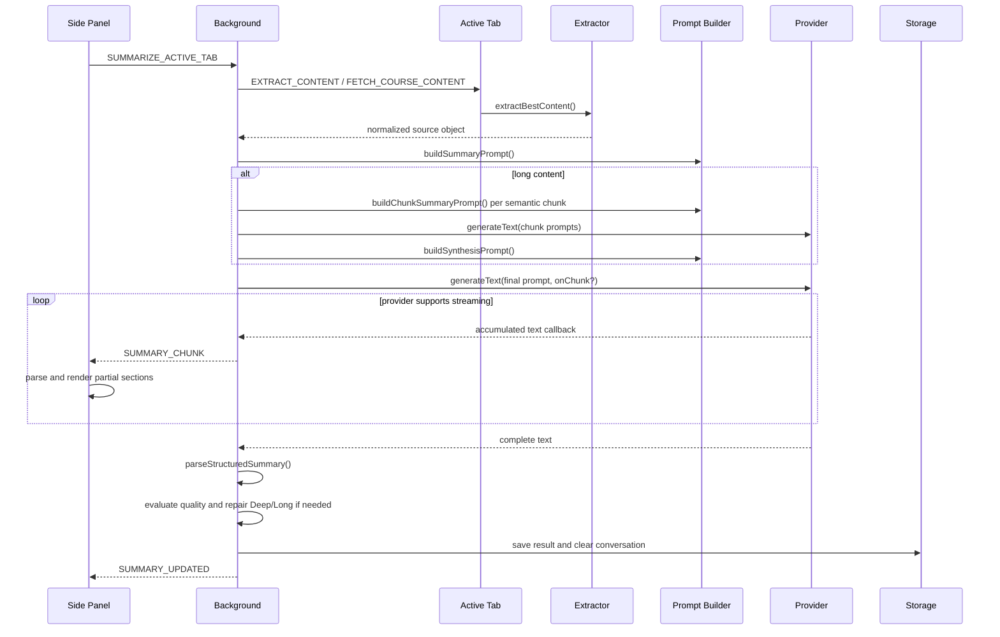

# Workflow

## Launch Paths

Summaries can start from:

- Side-panel **Generate**
- Context menu item `Summarize with DeepDigest`
- Keyboard command `summarize_page` (`Ctrl+Shift+S` / `Cmd+Shift+S`)

Context-menu and keyboard paths call `chrome.sidePanel.open()` synchronously, then run the same summary workflow as the side-panel button.

## Summary Generation

## Source Priority

`selected text → YouTube → course → webpage`.

## Workflow Phases

`workflow-store.js` tracks per-tab phases including extraction, summarizing, completed, error, and cancelled states. `ui-notifier.js` sends progress updates to the matching side panel.

## Semantic Chunking

`lib/semantic-chunker.js` uses timestamp segments, paragraphs, sentences, clauses, and word boundaries in that order. YouTube content over 24,000 characters, webpage content over 60,000 characters, and course content over 50,000 characters may be split into target 12,000-character chunks, with a maximum of four source chunks plus one synthesis request.

Synthesis treats chunks as sequential, removes overlap artifacts, preserves source hierarchy and timestamps, and does not invent missing transitions.

## Prompt and Language Flow

Settings are normalized by `lib/settings-schema.js` and read through `lib/storage.js`. `summaryLanguage` (configured with built-in options English, Vietnamese, or user-provided `customLanguages`) is passed into the common prompt envelope via a critical language directive, so all source templates and synthesis prompts write output in the selected language consistently while keeping parser section headings stable. Provider modules receive one final prompt string and remain prompt-agnostic.

## Follow-Up Questions

`DEEP_DIVE_ACTIVE_TAB` builds a deep-dive prompt from the saved summary, available Deep fields, recent conversation, relevant source excerpts, and up to 6,000 characters of source content. Conversation history is capped to six turns. A new summary clears prior follow-up history for that tab.

## Cancellation

Summary jobs are scoped to the initiating tab. The background keeps one `AbortController` per active tab job. The side panel sends `CANCEL_SUMMARIZE`; the controller aborts the provider request, marks workflow state as cancelled, and prevents a partial result from being saved.

## Tab Lifecycle

- The side panel requests the active tab ID when opened.
- Switching tabs refreshes from that tab's saved result and workflow state.
- Messages with a different `tabId` are ignored so an older tab cannot overwrite the current panel.
- Closing a tab clears its result, conversation, workflow state, and in-memory cache.

## Quality Gate and Repair

After parsing:

1. `SummarizerQuality.evaluateSummary()` scores the structured result.
2. Deep/Long failures trigger one targeted repair prompt for weak or missing sections.
3. `mergeRepairedSections()` replaces only weak sections.
4. Quality metadata is attached to the saved result.

## Deep/Long Expansion

| Result configuration | Initial expansion |
|---|---|
| Brief or Medium | First substantive section |
| Deep | First three substantive sections |
| Long | All substantive sections except `Details of the Video` |

Streaming rerenders preserve user expansion choices. The transcript remains collapsed until the user clicks its labeled toggle.

## Accessibility Behavior

The side panel exposes a polite live status region, screen-reader labels for section toggles, visible `:focus-visible` outlines, and reduced-motion CSS behavior. Expand-all and collapse-all controls update `aria-expanded` values for every section.
